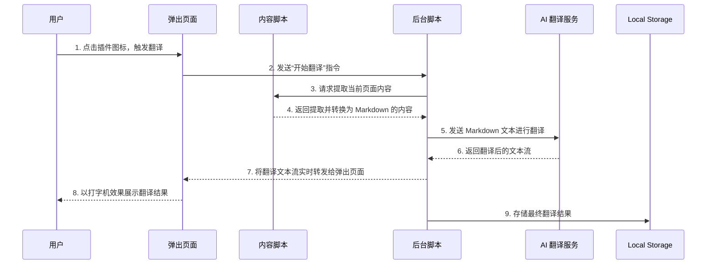

# Chrome 浏览器文章翻译插件技术架构文档

## 1. 概述

本文档旨在为“Chrome 浏览器文章翻译插件”项目提供全面的技术架构设计、规范和指导，确保项目在清晰、稳定、可扩展的轨道上进行开发和迭代。

设计核心遵循需求文档（`docs/requirement.md`）中定义的功能与非功能需求，优先考虑用户体验、代码质量和未来可维护性。

## 2. 整体架构

插件将采用基于 Chrome 扩展标准 Manifest V3 的模块化架构。整个系统分为以下几个核心部分：

| 模块 | 描述 | 核心职责 |
| :--- | :--- | :--- |
| **内容脚本 (Content Script)** | 注入到用户当前浏览页面的脚本。 | - 使用 `@mozilla/readability` 库提取页面主内容。<br>- 将提取的 HTML 转换为 Markdown 格式。<br>- 将处理后的内容发送给后台脚本。 |
| **后台脚本 (Background Script)** | 作为插件的中央处理器，在后台持续运行。 | - 接收来自内容脚本和弹出页面的消息。<br>- 调用 AI 翻译服务。<br>- 管理插件状态和本地存储。 |
| **弹出页面 (Popup Page)** | 用户点击浏览器工具栏图标时展示的 UI 界面。 | - 作为用户交互的主要入口。<br>- 向后台脚本发送翻译指令。<br>- 接收并以“打字机”效果动态展示翻译结果。 |
| **AI 翻译服务 (AI Service)** | 封装了与大语言模型交互的逻辑。 | - 提供 OpenAI SDK 兼容的接口。<br>- 支持模型切换（例如，从 Qwen 切换到其他模型）。<br>- 处理 API 请求、认证和错误。 |
| **本地存储 (Local Storage)** | 利用 Chrome 的 `chrome.storage.local` API。 | - 持久化存储最近一次的翻译结果，以便下次打开时快速加载。 |

### 2.1. 数据流转示意图



## 3. 技术选型

为了实现现代化、高效且易于维护的目标，我们选用以下技术栈：

| 领域 | 技术/库 | 选用理由 |
| :--- | :--- | :--- |
| **核心框架** | **无 (原生 JavaScript/TypeScript)** | 插件逻辑相对简单，无需引入重型框架（如 React、Vue），以保持轻量和高性能。 |
| **脚本语言** | **TypeScript** | 提供静态类型检查，增强代码健壮性，减少运行时错误，提升开发效率和可维护性。 |
| **内容提取** | **`@mozilla/readability`** | Mozilla 官方库，Firefox“阅读模式”的核心，能精准提取文章正文，完美契合需求。 |
| **HTML 转 Markdown** | **`turndown`** | 功能强大且灵活的库，能可靠地将 HTML 转换为 Markdown，并支持自定义规则以处理图片等元素。 |
| **AI 服务调用** | **`fetch` API (原生)** | 使用浏览器原生 API 发起对 AI 服务的 HTTP 请求，实现与 OpenAI SDK 兼容的流式读取。 |
| **UI 框架** | **无 (原生 HTML/CSS)** | 弹出页面 UI 简洁，直接使用原生技术能最大化性能，并方便实现自定义的流畅动画效果。 |
| **构建工具** | **`Vite`** | 提供极速的开发服务器和高效的构建能力，对 TypeScript 和现代 Web 技术有良好支持。 |
| **代码规范** | **`ESLint` + `Prettier`** | 强制执行统一的代码风格和质量标准，确保团队协作的一致性。 |

## 4. 目录结构规范

清晰的目录结构是高效开发和维护的基础。项目将采用以下结构：

```
md-wx-chrome-plugin/
├── docs/                      # 项目文档
│   ├── requirement.md         # 需求文档
│   └── technical-architecture.md # 技术架构文档
├── dist/                      # 插件打包输出目录
├── public/                    # 存放静态资源
│   ├── icons/                 # 插件图标
│   │   ├── icon16.png
│   │   ├── icon48.png
│   │   └── icon128.png
│   └── manifest.json          # 插件配置文件
├── src/                       # 源代码目录
│   ├── background/            # 后台脚本
│   │   └── index.ts
│   ├── content/               # 内容脚本
│   │   └── index.ts
│   ├── popup/                 # 弹出页面
│   │   ├── index.html
│   │   ├── script.ts
│   │   └── style.css
│   ├── services/              # 公共服务模块
│   │   ├── ai-translator.ts   # AI 翻译服务
│   │   └── storage.ts         # 本地存储服务
│   └── utils/                 # 通用工具函数
│       └── markdown-converter.ts # Markdown 转换工具
├── package.json               # 项目依赖与脚本配置
├── tsconfig.json              # TypeScript 配置文件
└── vite.config.ts             # Vite 配置文件
```

## 5. 编码与代码风格规范

为确保代码质量和一致性，所有代码提交都必须遵循以下规范：

1.  **语言**:
    *   统一使用 **TypeScript** 进行开发。
    *   开启并遵循严格的 `tsconfig.json` 规则。

2.  **代码风格**:
    *   使用 **Prettier** 自动格式化代码，确保风格统一（如缩进、引号、分号等）。
    *   使用 **ESLint** 进行代码质量检查，遵循推荐的规则集（如 `eslint:recommended` 和 `plugin:@typescript-eslint/recommended`）。

3.  **命名规范**:
    *   **变量/函数**: 使用驼峰命名法 (camelCase)，例如 `fetchTranslation`。
    *   **类/类型/接口**: 使用帕斯卡命名法 (PascalCase)，例如 `class ArticleParser`。
    *   **常量**: 使用大写蛇形命名法 (UPPER_SNAKE_CASE)，例如 `const API_KEY`。
    *   **文件名**: 使用短横线命名法 (kebab-case)，例如 `ai-translator.ts`。

4.  **注释**:
    *   **函数/方法**: 必须添加 JSDoc 风格的函数级注释，清晰说明函数的功能、参数和返回值。
    *   **复杂逻辑**: 在实现复杂的算法或业务逻辑处，添加必要的行内中文注释，解释其实现思路。

5.  **模块化**:
    *   遵循单一职责原则，每个文件/模块只做一件事。
    *   优先使用 ES6 模块 (`import`/`export`)。

6.  **错误处理**:
    *   所有异步操作（如 API 请求、文件读写）都必须包含 `try...catch` 或 `.catch()` 块，进行恰当的错误处理和用户反馈。
    *   避免在控制台打印敏感信息。

7.  **异步编程**:
    *   优先使用 `async/await` 语法处理异步操作，以提高代码的可读性。

通过遵循以上架构设计和规范，我们可以构建一个高质量、易于维护且用户体验出色的 Chrome 插件。
